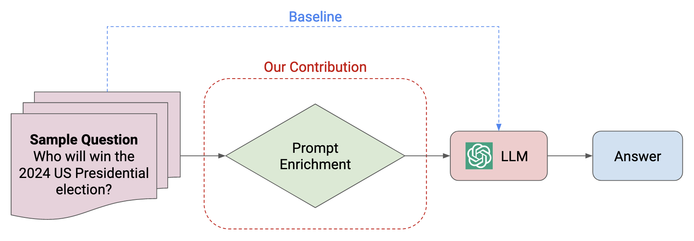
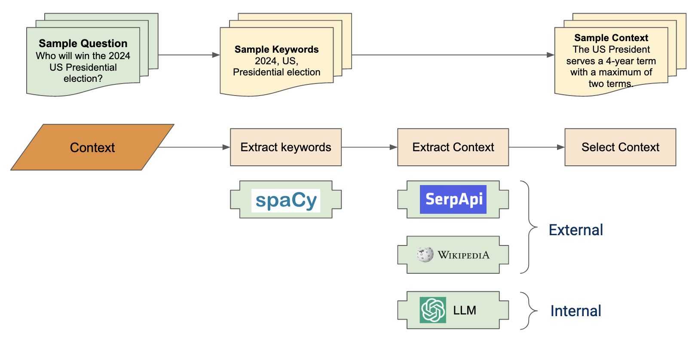
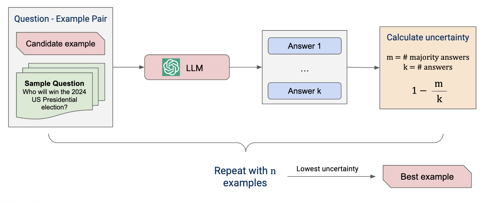
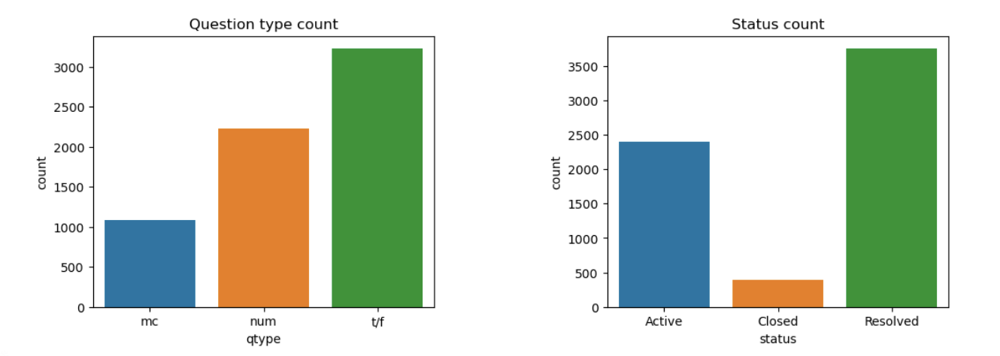

# Automating Prompt Engineering for Forecasting Tasks

DATASCI 210 - Capstone Section 003, Summer 2023 Master of Information and Data Science University of California, Berkeley

## Table of Contents

- [Team](#team)
- [Project](#project)
- [Pipeline](#pipeline)
  - [Context Enrichment](#context-enrichment)
  - [Active Prompt Example Selection](#active-prompt-example-selection)
  - [Evaluation Data](#evaluation-data)
  - [Experimental Results](#experimental-results)
- [Instructions](#instructions)
- [Demo](#demo)

## Team

* **Greg Rosen**
* **Coco Cao Jinglu**
* **Severin Perez**
* **Luc Robitaille** 

## Project

Predicting the future is notoriously difficult, but what if we could capture the knowledge embedded in large language models (LLMs) to make the task easier? Our project aims to improve LLM performance at forecasting tasks by converting simple questions into rich prompts with relevant context and examples. Our goal is to explore LLM effectiveness on forecasting tasks without the need for resource-intensive fine-tuning.

## Pipeline

Our solution to this problem is a pipeline that automatically enriches simple prompts during a two-stage process. First, we explore *context enrichment* where we identify and attach internal and external context to a question in order to provide the LLM with more information about the question. Second, we use active prompt methodology to identify optimal examples for use with a given question. These examples are selected based on the degree to which they reduce model uncertainty when answering a question. The below diagram shows the end-to-end pipeline, as well as the baseline pipeline that we use for comparison.

### Context Enrichment

We explored two means of context enrichment: internal and external. Internal context is information already known to the LLM. We extract this information by asking the LLM to identify entities, dates, and other important items in the text of a question, and then to provide definitions, history, and information on the relationships between each of the entities. We then use this internal context to enrich the original prompt. External context is similar, but drawn from external sources. For example, we explored using both Wikipedia and Google search results to enrich the original prompt. An illustration of this process is shown below.

### Active Prompt Example Selection

We used [active prompt](https://arxiv.org/abs/2302.12246) methodology, as described by Diao et al. (2023) to select optimal examples for use with a given question. The active prompt methodology is based on the idea that the LLM is most effective when it is provided with examples that reduce its uncertainty. We use the LLM to generate a set of candidate examples for a given question, and then select the optimal examples from this set based on the degree to which they reduce model uncertainty. An illustration of this process is shown below.

### Evaluation Data

To evaluate pipeline performance, we use the [Autocast dataset](https://github.com/andyzoujm/autocast), as described by Zou et al. (2022). The Autocast dataset includes a variety of true/false, multiple choice, and numeric forecasting questions as well as crowd predictions. We use the crowd predictions as the target metric, specifically on "Active" questions (meaning those for which there is not yet any answer). The below chart shows the count of different question types in the Autocast dataset. Further details on the data we use are provided in the [data](data) folder.

### Experimental Results

We evaluated the performance of our pipeline using several permutations of prompt enrichment. In-range prediction is defined as the percentage of pipeline predictions that fell within the defined acceptable range compared to the crowd forecasts. The range was necessary because crowd experts were not required to make only a single choice–they could hedge their prediction by assigning probabilities to multiple choices. So, on a true-false question, where 0 is false and 1 is true, the average crowd choice could be 0.15 (meaning significantly more false than true). If our pipeline average was 0 or 0.05 (meaning within our range of 0.2 in either direction) we considered it to be “in range”, but if it was 0.45 we did not.

In all, we found only marginal performance improvements over baseline. Given that there were only a total of 98 questions throughout these experiments, the small changes between baseline and context may not be statistically meaningful. A table and chart of the results are shown below.

We were surprised to see that adding in optimized examples actually reduced performance. We have several hypotheses for this, to include that the model may have been taking past examples into account when answering new questions, despite specific instructions not to in the system prompt.

Separately, we noticed that the system prompt has significant ramifications for whether context and examples improve performance over baseline, and for that matter on how well the baseline itself does. We experimented with a wide variety of system prompts and see this as an area for further experimentation. A good system prompt that helps the LLM understand how to use context and examples is clearly important.

| Pipeline           | % in-range predictions |
|--------------------|-----------------------|
| Baseline           | 27.55%                |
| Context            | 27.55%                |
| External context   | 30.61%                |
| Example            | 24.49%                |
| Context + example  | 28.57%                |

## Instructions

The [notebooks](notebooks) folder contains the code used to generate the results in this project. The notebooks include several exploratory notebooks, as well as two primary notebooks to run the context enrichment pipeline and evaluate results using several permutations of enrichment pipelines. 

## Demo

The [demo](demo) folder contains a demo of the pipeline. The demo is a simple web application that allows non-real-time exploration of our dataset. Due to resource and model hosting considerations, this demo does not do real-time inference of the actual questions. It does however show how the pipeline works in terms of prompt enrichment. See demo [here](https://llm-forecasting-prompts-123.streamlit.app/).
